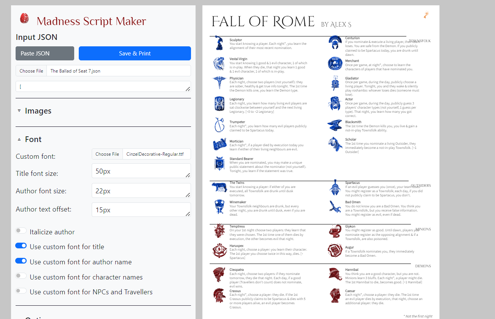
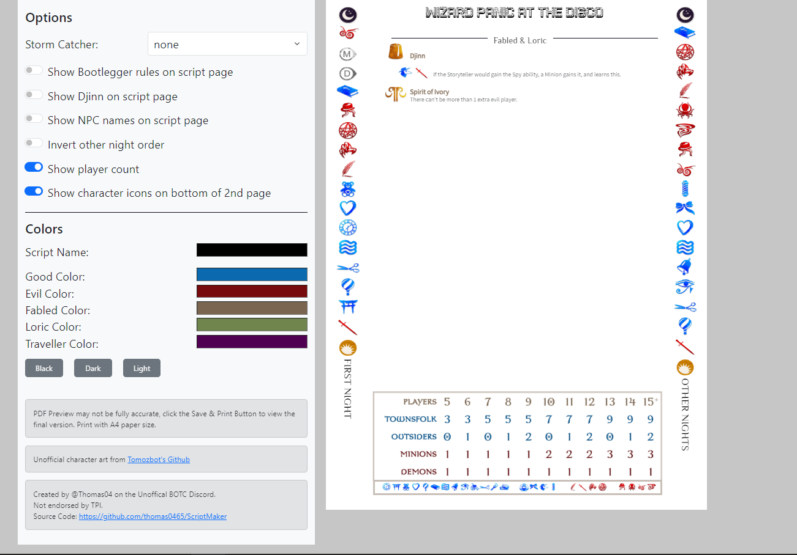
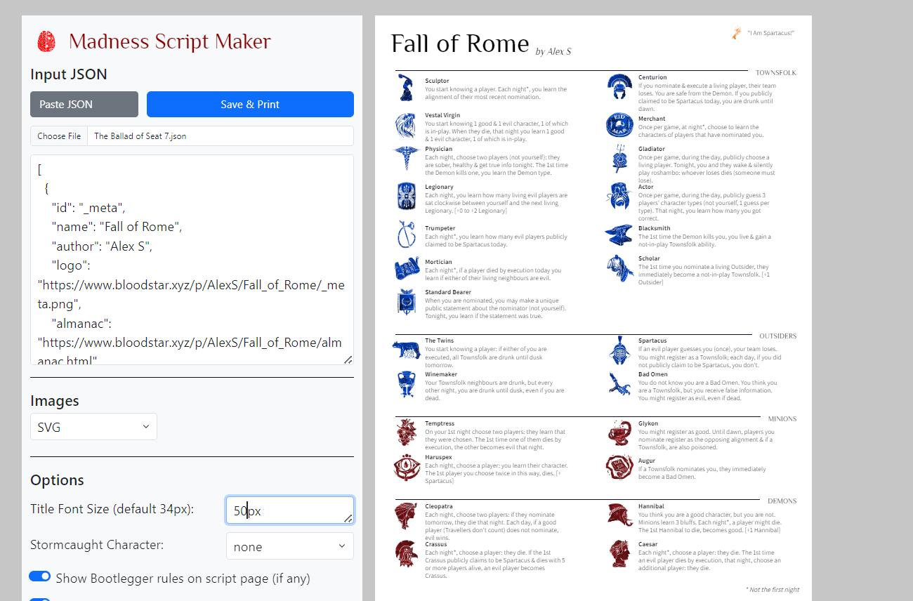
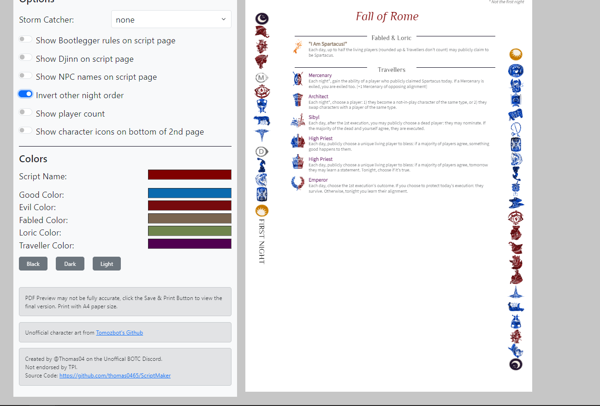
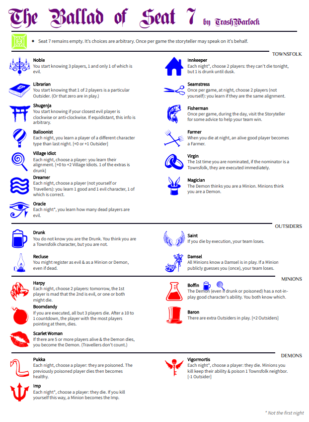
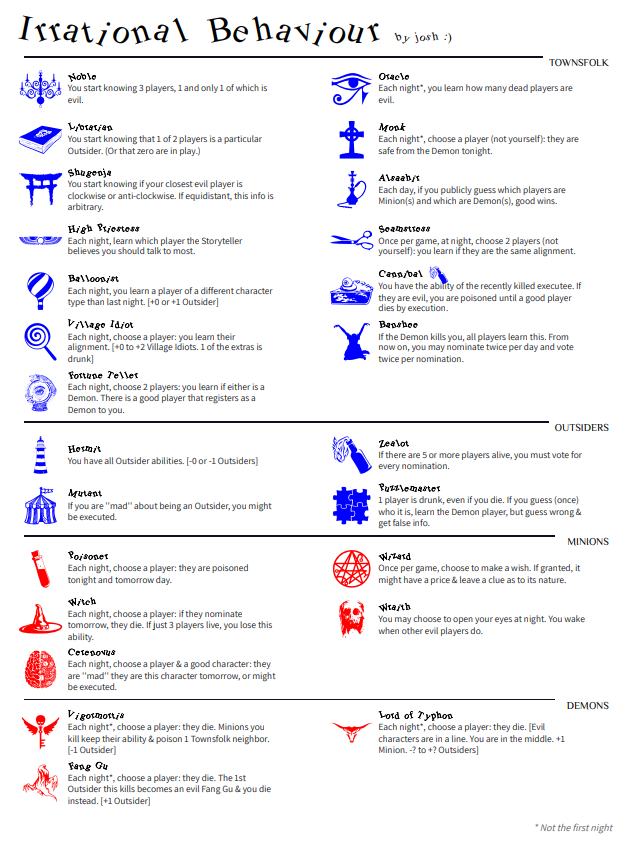

# Madness Script Maker
A Blood on the Clocktower script pdf creator, with added customization options.

For any feedback or questions, contact @Thomas04 on the Unoffical BOTC discord. 

#### https://madness-script-maker.vercel.app

## Features
* Full homebrew support

* Upload a custom font file that can be used for the title, author, and character names.

* Choose between Unofficial PNG, SVG or your external character images

* Change title and author font size

* Show Stormcaught character on the script like a jinx. Stormcaught character will also be indicated on the back page under Storm Catcher

* Show Bootlegger rules at the top or bottom of the script

* Toggle showing Djinn on script page

* Toggle showing NPC names on script page

* Toggle inverting the other night order on back page

* Toggle player count image on back page

* Toggle showing all character images on back page footer (useful for pulling tokens with just the back page)

* Adjust colors for the Script name, author and names of characters

* Option to hide individual jinxes on the script 

* Dynamically adjust for teensyville or 25+ character scripts

## Screenshots 

## Running Locally
This project was created with Angular. 

To run locally, have npm and angular installed.

Run the command 'ng serve' in the ScriptMaker folder.

Once the server is running, open your browser and navigate to `http://localhost:4200/`.

## Acknowledgements

* Blood on the Clocktower and all characters are copyright of The Pandemonium Intstitute and Steven Medway. This project is not endorsed by TPI.

* Unofficial character icons are sourced from https://github.com/tomozbot/botc-icons

* This project uses [Angular CLI](https://github.com/angular/angular-cli) version 21.1.3, [ngx-print](https://www.npmjs.com/package/ngx-print), [ngx-color-picker](https://www.npmjs.com/package/ngx-color-picker) and [bootstrap](https://getbootstrap.com)
